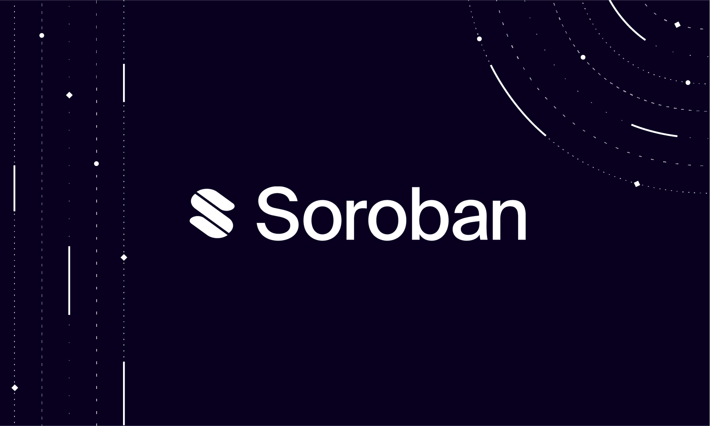

# Token Playground Chapter 1: Introduction & Motivation.



## Soroban

Soroban, the Stellar smart contract platform, is currently under development, and its official launch is expected to be sometime in 2023.

## Tokens in Soroban?

**Tokens** are one of the most important applications on any smart contracts platform. In the case of Stellar, this is especially relevant because it already has a solution for tokens directly on the "Stellar Classic Blockchain" **(The Stellar Assets / Classic Tokens)**, even before Soroban.

## The Token Playground's Motivation

Our motivation is to explain to developers coming to Soroban **how Stellar Assets can coexist with smart contracts**, how they can take advantage of Soroban, and what limitations could be presented.

Soroban provides a mechanism to **wrap a (classic) Stellar asset in a smart contract** so that the token can be minted and transferred in Soroban. However, a lot of questions are arised...

- How can developers **issue tokens** in Soroban, or **wrap an existing Stellar Classic Asset**?
- Are this two chains **sharing the token balance** for an specific address?
- Whan happens if the **issuer mints** tokens in Soroban after wrapping the asset?
- Can the Smart Contract prevent Stellar Classic transactions of the Stellar Asset?
- Can we enforce to some logic to be applied when they are transferred?

We have developed a **token playground** to explain how Stellar assets can be managed from a Soroban smart contract. For that, we have created a set of scripts that will show you in a practical way the main actions involved in token management:

- Issue an Stellar Asset
- Get info about an Stellar Asset (Asset Code, Issuer, Balance ) 
- Wrap a Stellar Asset from Stellar to Soroban (token)
- Mint wrapped token in Soroban 
- Get information from the wrapped token usins SAC contract 
- Get all contract id's from an asset issuer
- Use all user balance inside Soroban (Classic & Soroban)
- Call the token contract from another contract


```
```

___

## Tokens in Other Blockchains:

A well-known smart contract platform is the Ethereum VM. The Ethereum ecosystem has developed different standards to create, mint, burn, and transfer tokens, such as ERC20 for fungible tokens and ERC721 for NFT. An EVM smart contract is fully responsible for the creation, minting, burning, total supply, and transfer of the token that it manages, ensuring the ownership of the holders (address) over their balances. This control over token operations and supply allows EVM tokens' smart contract to offer some nice features, such as:

- Link transfer operations to smart contract logic, such as paying royalties to NFT authors or applying fees
- Create collateralized tokens for lending redemption and ensure 1:1 with the tokens they represent